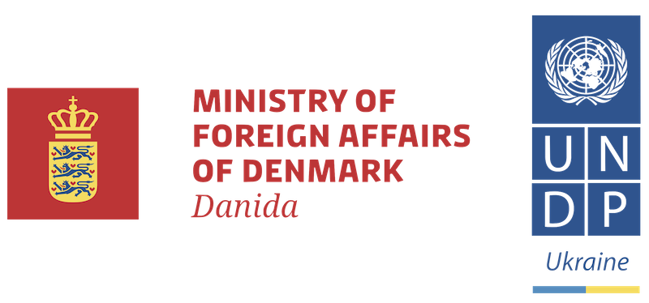

#Антикорупційний урок

##Програми розвитку ООН в Україні

Короткий навчальний посібник **«Антикорупційний урок»** є збіркою матеріалів, які можуть бути корисні вчителям для проведення відповідного уроку у старших класах середньої школи до **Міжнародного дня боротьби з корупцією**. Цей день відзначається 9 грудня у всьому світі, згідно з рішенням Генеральної Асамблеї ООН. Саме у цей день у 2003 році у мексиканському місті Меріда на політичній конференції високого рівня була відкрита для підписання Конвенція ООН проти корупції. 
У посібнику зроблено огляд історичної генези явища корупції, розглянуто різноманітні визначення корупції, окреслено основні типи корупції, проаналізовано сучасне українське антикорупційне законодавство, представлено архітектуру новостворених антикорупційних органів, їх повноваження і функції, а також наведено приклади їх роботи. 

**Проект «Прозорість та доброчесність публічного сектору»** впроваджується ПРООН в Україні за підтримки Міністерства закордонних справ Данії у 2015-2018 роках. 

**Програма розвитку Організації Об’єднаних Націй (ПРООН)** налагоджує партнерство на всіх суспільних рівнях, сприяючи розвитку країни, підвищуючи їх здатність протистояти кризам, і підтримує економічне зростання задля поліпшення життя кожної людини. ПРООН працює в 177 країнах та пропонує глобальне бачення з урахуванням специфіки місцевого розвитку для розширення прав і можливостей людини і підвищення життєздатності держав.
В Україні три головні сфери діяльності ПРООН в галузі розвитку – демократичне управління та місцевий розвиток; подолання бідності, досягнення процвітання та Цілей розвитку тисячоліття; енергетика та охорона навколишнього середовища. В кожній з цих тематичних сфер ПРООН намагається врівноважити роботу з інструментарієм державної політики, адвокацією, розбудовою спроможностей партнерів і пілотуванням нових ініціатив. ПРООН працює в Україні з 1993 року. [www.ua.undp.org](www.ua.undp.org)

© Програма розвитку ООН в Україні, 2016

*Всі права захищені. Жодна частина цієї публікації не може бути відтворена, збережена в пошуковій системі або передана в будь-якій формі і будь-якими засобами, електронними, механічними, шляхом відеозапису або іншим чином, без попереднього дозволу. Думки, висновки чи рекомендації належать авторам та упорядникам цього видання і не обов’язково відображають погляди Міністерства закордонних справ Данії, Програми розвитку ООН чи інших агентств ООН.*

